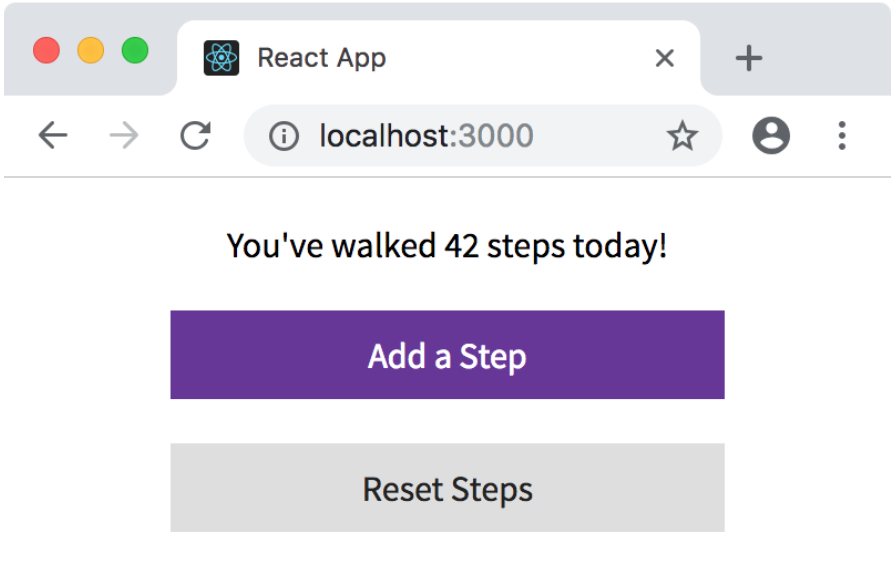
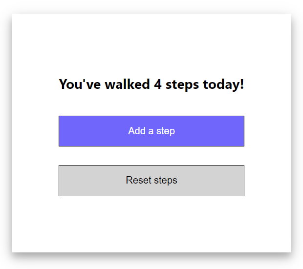

# Week 11 - Assignment 2

[Welcome to Pesto assignment - 3 from the Week 11](https://pestotech.teachable.com/courses/1782350/lectures/40231475)

# Redux Exercise 2:

Create a brand new React project with [Create React App](https://github.com/facebook/create-react-app) or [CodeSandbox](https://codesandbox.io/s/new).

Delete the boilerplate code from index.js and start fresh.

Add Redux to the project as you’ve done before.

There’s just one component here: the StepCounter. It should have 2 buttons, one “Add Step” and one “Reset Steps”, as shown above. Clicking “Add Step” should increment the step counter by 1, and “Reset Steps” should clear it. (think: how many actions will you need?)

For each action, create an action constant and an action creator. Use `mapDispatchToProps` to pass the actions in as props to the StepCounter component. Try out the object form of `mapDispatch` as well as the function form.

You can break the project up into files if you like, or keep it all in one file. If you want a suggestion, try for an index.js with the createStore + reducer, a StepCounter.js with the component and any necessary connect() setup, and an actions.js with the actions (don’t forget to export them!).

If you want to make it pretty, go for it.

## Guidelines: 

1. Add Redux into the application.

2. Wire Redux with the React App using built in methods.

3. The Action, Dispatchers and Reducer files should have been created.

4. Bonus for creating separate files for each.

5. Bonus for adding styles to the application.

6. The Action - Dispatch - Reducer - Store flow should work as expected.

## Snap:

# Getting Started with Create React App

This project was bootstrapped with [Create React App](https://github.com/facebook/create-react-app).

## Available Scripts

In the project directory, you can run:

### `yarn start`

Runs the app in the development mode.\
Open [http://localhost:3000](http://localhost:3000) to view it in your browser.

The page will reload when you make changes.\
You may also see any lint errors in the console.

### `yarn test`

Launches the test runner in the interactive watch mode.\
See the section about [running tests](https://facebook.github.io/create-react-app/docs/running-tests) for more information.

### `yarn build`

Builds the app for production to the `build` folder.\
It correctly bundles React in production mode and optimizes the build for the best performance.

The build is minified and the filenames include the hashes.\
Your app is ready to be deployed!

See the section about [deployment](https://facebook.github.io/create-react-app/docs/deployment) for more information.

### `yarn eject`

**Note: this is a one-way operation. Once you `eject`, you can't go back!**

If you aren't satisfied with the build tool and configuration choices, you can `eject` at any time. This command will remove the single build dependency from your project.

Instead, it will copy all the configuration files and the transitive dependencies (webpack, Babel, ESLint, etc) right into your project so you have full control over them. All of the commands except `eject` will still work, but they will point to the copied scripts so you can tweak them. At this point you're on your own.

You don't have to ever use `eject`. The curated feature set is suitable for small and middle deployments, and you shouldn't feel obligated to use this feature. However we understand that this tool wouldn't be useful if you couldn't customize it when you are ready for it.

## Learn More

You can learn more in the [Create React App documentation](https://facebook.github.io/create-react-app/docs/getting-started).

To learn React, check out the [React documentation](https://reactjs.org/).

### Code Splitting

This section has moved here: [https://facebook.github.io/create-react-app/docs/code-splitting](https://facebook.github.io/create-react-app/docs/code-splitting)

### Analyzing the Bundle Size

This section has moved here: [https://facebook.github.io/create-react-app/docs/analyzing-the-bundle-size](https://facebook.github.io/create-react-app/docs/analyzing-the-bundle-size)

### Making a Progressive Web App

This section has moved here: [https://facebook.github.io/create-react-app/docs/making-a-progressive-web-app](https://facebook.github.io/create-react-app/docs/making-a-progressive-web-app)

### Advanced Configuration

This section has moved here: [https://facebook.github.io/create-react-app/docs/advanced-configuration](https://facebook.github.io/create-react-app/docs/advanced-configuration)

### Deployment

This section has moved here: [https://facebook.github.io/create-react-app/docs/deployment](https://facebook.github.io/create-react-app/docs/deployment)

### `yarn build` fails to minify

This section has moved here: [https://facebook.github.io/create-react-app/docs/troubleshooting#npm-run-build-fails-to-minify](https://facebook.github.io/create-react-app/docs/troubleshooting#npm-run-build-fails-to-minify)
