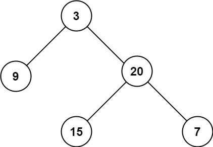

# Week 8 - Assignment 1

[Welcome to Pesto assignment - 1 from the Week 8](https://pestotech.teachable.com/courses/1782350/lectures/40231418)

## Maximum Depth of Binary Tree

Given the root of a binary tree, return its maximum depth.

A binary tree's maximum depth is the number of nodes along the longest path from the root node down to the farthest leaf node.

### Example 1:

Input: root = [3, 9, 20, null, null, 15, 7]

Output: 3

### Example 2:

Input: root = [1, null, 2]

Output: 2

### Constraints:

● The number of nodes in the tree is in the range [0, 104].

● -100 <= Node.val <= 100
