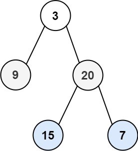

# Week 8 - Assignment 3

[Welcome to Pesto assignment - 3 from the Week 8](https://pestotech.teachable.com/courses/1782350/lectures/40231418)

## Binary Tree Level Order Traversal

Given the root of a binary tree, return the level order traversal of its nodes' values. (i.e. from left to right, level by level).

### Example 1:

Input: root = [3, 9, 20, null, null, 15, 7]
Output: [[3], [9, 20], [15,7]]

### Example 2:

Input: root = [1]
Output: [[1]]

### Example 3:

Input: root = []
Output: []

### Constraints:

● The number of nodes in the tree is in the range [0, 2000].

● -1000 <= Node.val <= 1000
